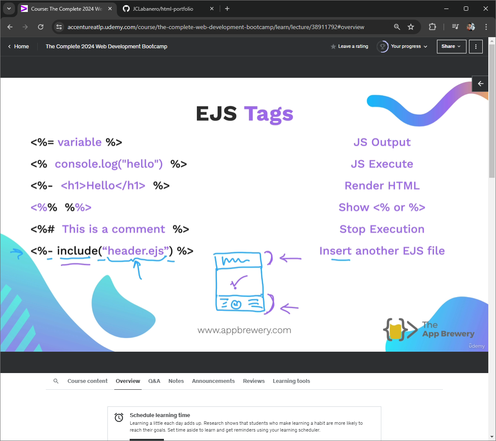
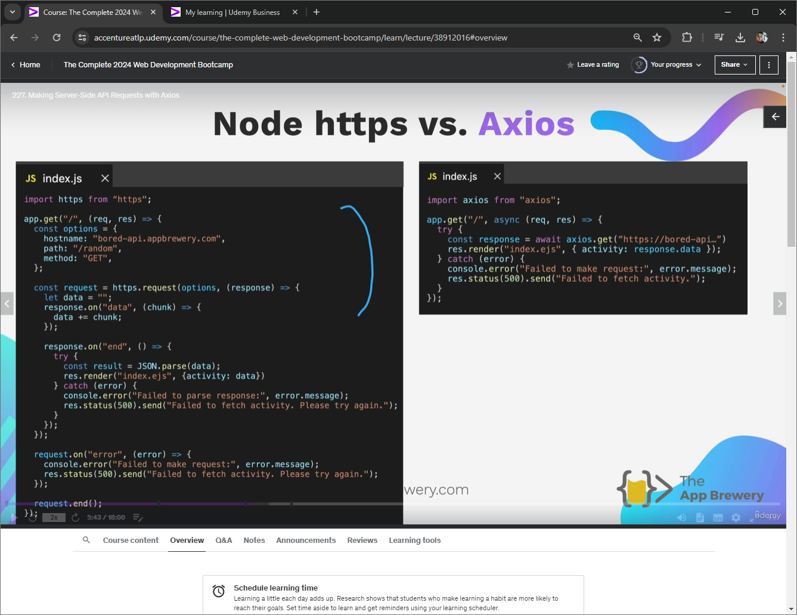

# html-portfolio

## Hey

### Terminal Commands

[More Commands Here]("https://gist.github.com/bradtraversy/cc180de0edee05075a6139e42d5f28ce")

- list the file ```ls```
- make directory ```mkdir```
- change directory ```cd```
- create ```touch file.extension```
- open file ```open file.extension```
- ```open ~a /Applications/Visual\Studio\Code```
- remove file ```rm file.extension```
- remove everything ```rm *```
- remove a directory ```rm -r directoryName```
- -f force a tag
- print working directory ```pwd```

### Node JS

- Writing file with node native modules [Node.js](https://nodejs.org/en/learn/manipulating-files/writing-files-with-nodejs)
- Node Package Managers [npm](https://www.npmjs.com/)
- V12 node enable Ecma Script M (ESM)
  - in package json "type": "module"

### Expess

- Using ExpressJS to make server [ExpressJS](https://expressjs.com/)

```cmd
npm init -y
```

- In JS, string interpolation only works with backtics `${variableName}`

- to see which ports are open

```cmd
netstat -ano | findstr "LISTENING"
```

- How to properly close a port [Blog Post](https://dev.to/sylwiavargas/how-to-properly-close-a-port-2p36)

- Using nodemon from npm to run updating port (-g for global)

```cmd
npm i -g nodemon
```

```cmd
nodemon file.extension
```

```cmd
Set-ExecutionPolicy remotesigned -scope process
```

- [HTTP Status Codes](https://developer.mozilla.org/en-US/docs/Web/HTTP/Status)

- A tool for testing or debugging server [Postman](https://www.postman.com/downloads/)

- Using npm install to install all dependencies that are in package.json

```cmd
npm install
```

- body-parser morgan (middlewares) (logging, error, pre-processing, auth)

- To get a parameter in end point url

```js
const variable = parseInt(req.params.id);
```

- To get an array still with parameter end point

```js
const variable = req.query.name;
```

### EJS

- EJS is a view
- Install EJS from extensions



```ejs
<%- include("footer.ejs")%>
```

```js
res.render("name.ejs",{name:"JC"})
```

### axios

- Simplify http request or api request
- [Axios Documentation](https://axios-http.com/docs/example)
- [How to send basic auth with axios](https://stackoverflow.com/questions/44072750/how-to-send-basic-auth-with-axios)
- [Public API Lists](https://github.com/public-api-lists/public-api-lists)



- What makes an API restful?
  1. "uses standard http methods namely get, post, put, patch, delete"
  2. "use or return standard format (json/xml)"
  3. "api and client are separate from each other"
  4. "stateless? communicating independently every client and their requests"
  5. "resource-base unique names uniform resource identifier > ur locator"

### SQL

- [Test SQL Commands](https://sqliteonline.com/)
- [SQL Commands List](https://www.w3schools.com/sql/default.asp)

### POSTGRES

- [Postgres Commands List](https://www.w3schools.com/postgresql/index.php)
- [NPM Postgress DB](https://www.npmjs.com/package/pg)

### HASHING

- [NPM Bcrypt](https://www.npmjs.com/package/bcrypt)
- [EZ Authentication Strats](https://www.passportjs.org/)

### REACT

- ALWAYS USE RETURN CAUSE REACT BROKE ALOT BECAUSE OF THIS
- Prevent form to refresh

```js
  event.preventDefault();
```

### MINE

- [Title Case NPM](https://www.npmjs.com/package/title-case)

### General Sources

[Appbrewery Course](https://www.appbrewery.co/p/web-development-course-resources/)
[Material UI](https://mui.com/material-ui/)
[Spread Syntax](https://developer.mozilla.org/en-US/docs/Web/JavaScript/Reference/Operators/Spread_syntax)
[Stack Setting Ojb Value](https://stackoverflow.com/questions/11508463/javascript-set-object-key-by-variable?noredirect=1&lq=1)
[ReactJS Hooks](https://legacy.reactjs.org/docs/hooks-intro.html)
[Controlled Components](https://legacy.reactjs.org/docs/forms.html#controlled-components)
[ES6 Destructuring](https://developer.mozilla.org/en-US/docs/Web/JavaScript/Reference/Operators/Destructuring_assignment)
[FlatUIColor](https://flatuicolors.com/)
[React Hooks Docu](https://legacy.reactjs.org/docs/hooks-reference.html#usestate)
[Single Responsibility Principle](https://en.wikipedia.org/wiki/Single-responsibility_principle)
[Array Mapping](https://developer.mozilla.org/en-US/docs/Web/JavaScript/Reference/Global_Objects/Array/filter)
[Emoji Meaning](https://www.emojimeanings.net/list-smileys-people-whatsapp)
[Desc list element](https://developer.mozilla.org/en-US/docs/Web/HTML/Element/dl)
[React Dev Tools - Firefox](https://addons.mozilla.org/en-GB/firefox/addon/react-devtools/)
[React Dev Tools - Chrome](https://chromewebstore.google.com/detail/react-developer-tools/fmkadmapgofadopljbjfkapdkoienihi?hl=en)
[Stack Node.js vs ES6 import/export](https://stackoverflow.com/questions/31354559/using-node-js-require-vs-es6-import-export)
[Airbnb React/JSX Style Guide](https://github.com/airbnb/javascript/tree/master/react)
[CSS Properties](https://www.w3schools.com/cssref/index.php)
[Standard Attr](https://www.w3schools.com/tags/ref_standardattributes.asp)
[Expression VS Statement Video](https://www.youtube.com/watch?v=WVyCrI1cHi8&list=PL-xu4i_QDSxcoDNeh8rx5-pHCCTOg0XsI)
[Babel: JS compiler](https://babeljs.io/)
[Browser Based Dev Environment](https://codesandbox.io/)
[Hacker Typer](https://hackertyper.net/)
[Password Strength Checker](http://password-checker.online-domain-tools.com/)
[haveibeenpwned](https://haveibeenpwned.com/)
[Hackering](https://plaintextoffenders.com/)
[Text Encrypt/Decrypt](https://cryptii.com/)
[Text Encrypt/Decrypt 2](https://encode-decode.com/)
[See Global Cable Connections](https://www.submarinecablemap.com/)
[Principles of Writing JS](https://github.com/rwaldron/idiomatic.js)
[Editor Config for Colab Work](https://editorconfig.org/)
[Free Use Images](https://unsplash.com/)
[Free Use Illustrations ❤️](https://undraw.co/)
[JSON Structure Viewer](https://jsonviewer.stack.hu/)

#### UI Specific

[Lorem for Pictures ❤️](https://picsum.photos/)
[UIverse Code Snippets](https://uiverse.io/)
[Codepen Code Snippets](https://codepen.io/)
[Bootstrap Templates](https://mdbootstrap.com/)
[Generate Patters from CSS](https://pattern.monster/)
[UI Somewhat Debugger](https://chromewebstore.google.com/detail/pesticide-for-chrome/bakpbgckdnepkmkeaiomhmfcnejndkbi?pli=1&authuser=0)
[CSS Flex](https://css-tricks.com/snippets/css/a-guide-to-flexbox/) and [CSS Grid](https://css-tricks.com/snippets/css/complete-guide-grid/)
[Font Size Calculator](https://typescale.com/)
[Font Archetypes](https://archetypeapp.com/#)
